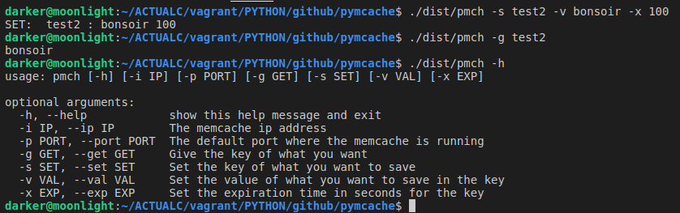

# MEMCACHE CLIENT

A client for memcached and a way to generate it's portable distribution.

## Requirements

- Python (3.x)
- pymemcache
- Pyinstaller


## How to generate your portable version

Just follow theese steps:

```shell

# Dont forget to install pyinstaller and pymemcache with the same pip
pip3 install pyinstaller pymemcache

# Then just hit
pyinstaller ./pmc.py --hidden-import=pymemcache --hidden-import=argparse --onefile --name pmch

# Then you will get some logs down here
32 INFO: PyInstaller: 3.5
32 INFO: Python: 3.5.2
33 INFO: Platform: Linux-4.15.0-70-generic-x86_64-with-Ubuntu-16.04-xenial
33 INFO: wrote /home/darker/ACTUALC/vagrant/PYTHON/github/pymcache/pmch.spec
37 INFO: UPX is available.
39 INFO: Extending PYTHONPATH with paths
['/home/darker/ACTUALC/vagrant/PYTHON/github/pymcache',
 '/home/darker/ACTUALC/vagrant/PYTHON/github/pymcache']
39 INFO: checking Analysis
....
```

Your distribution just got generated.


## How to use it

This is how to use it :

```shell
usage: pmch [-h] [-i IP] [-p PORT] [-g GET] [-s SET] [-v VAL] [-x EXP]

optional arguments:
  -h, --help            show this help message and exit
  -i IP, --ip IP        The memcache ip address default is 127.0.0.1
  -p PORT, --port PORT  The default port where the memcache is running default is 11211
  -g GET, --get GET     Give the key of what you want
  -s SET, --set SET     Set the key of what you want to save
  -v VAL, --val VAL     Set the value of what you want to save in the key
  -x EXP, --exp EXP     Set the expiration time in seconds for the key
```

Example:



## Author

- Sanix-darker